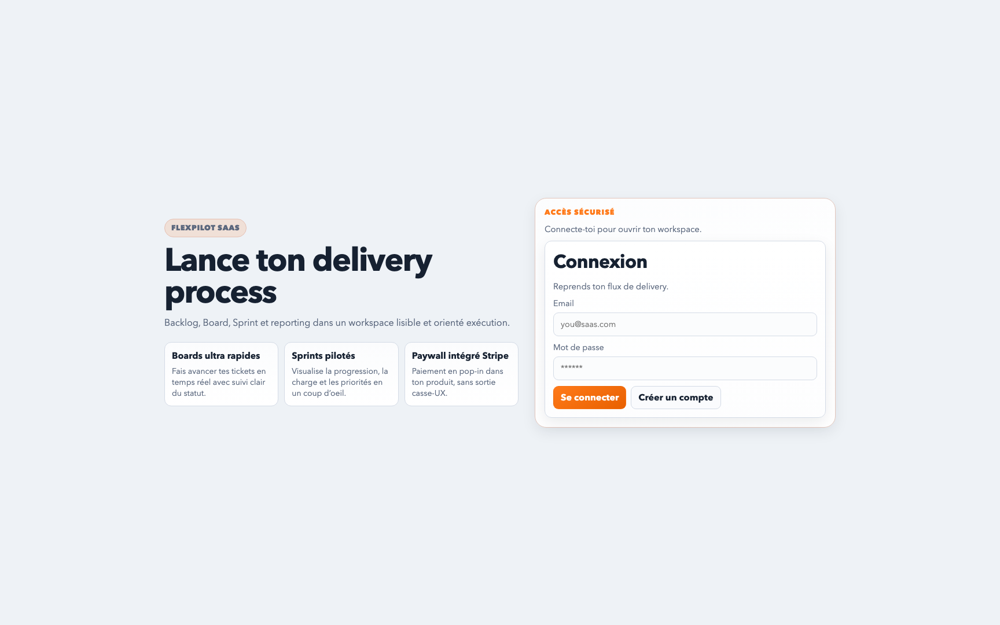
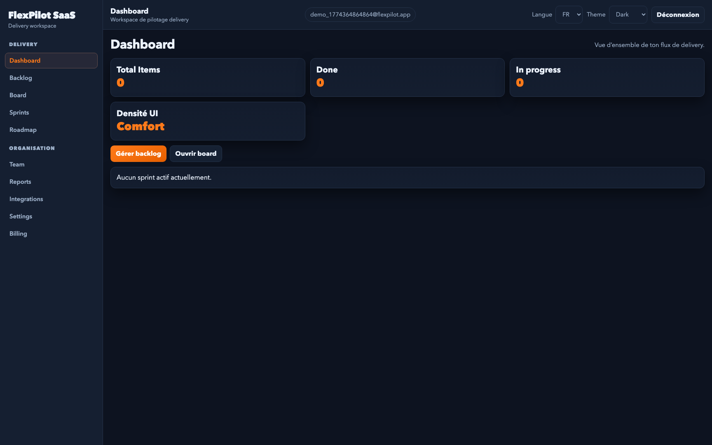
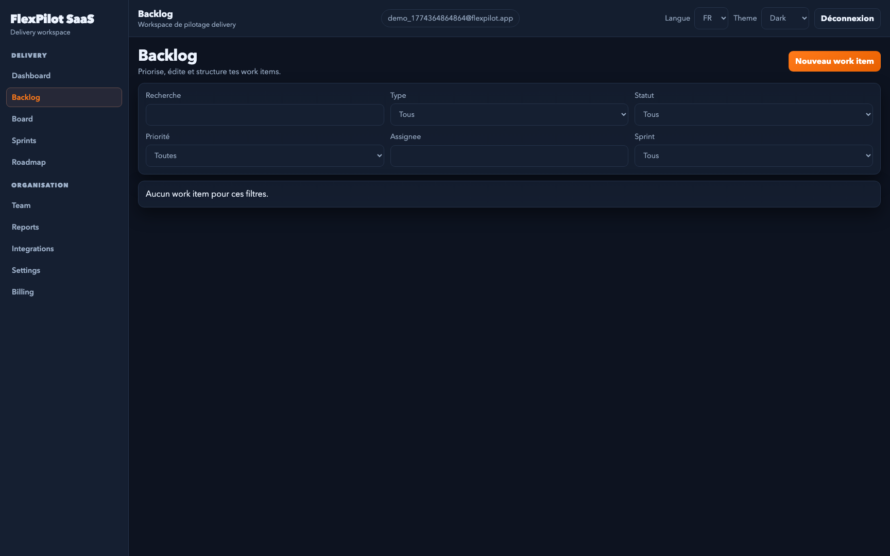
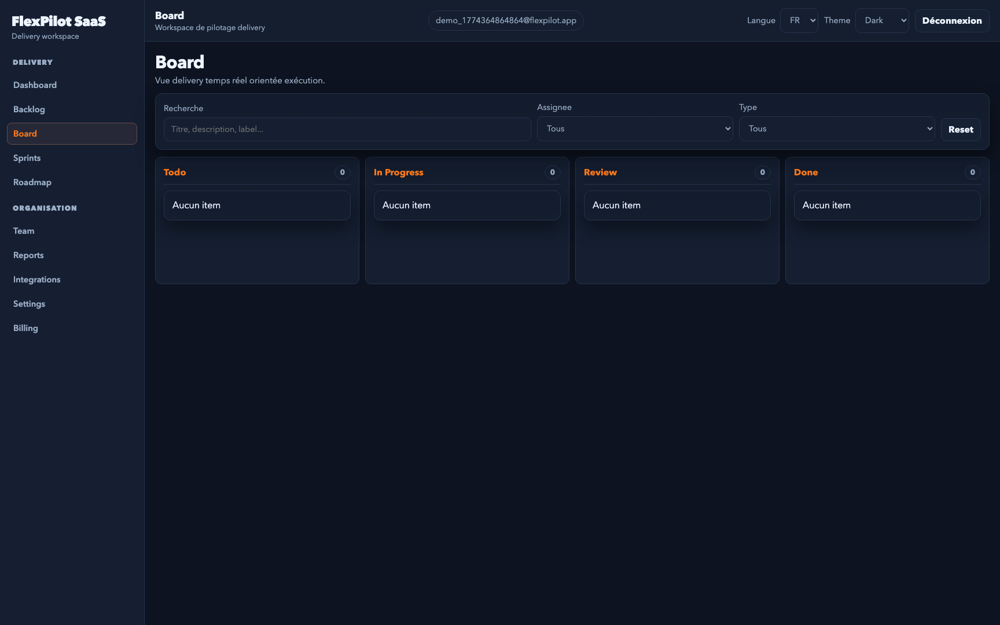
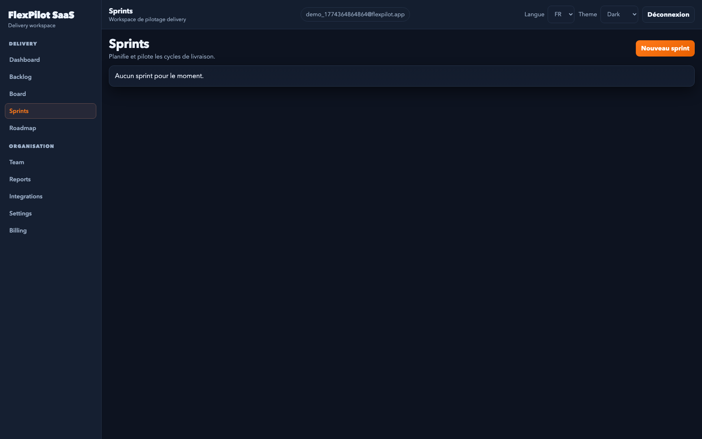
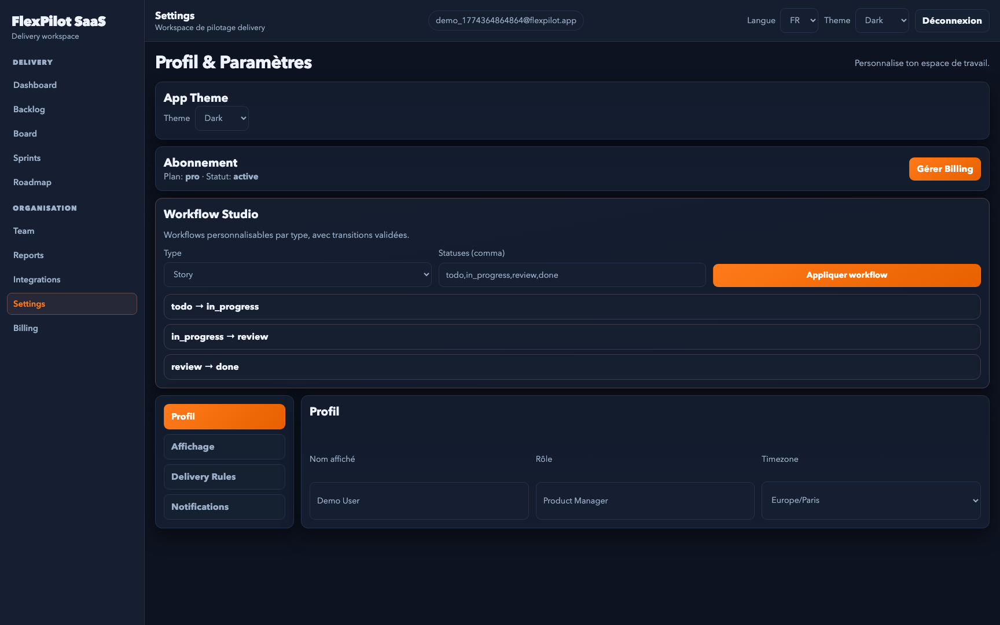
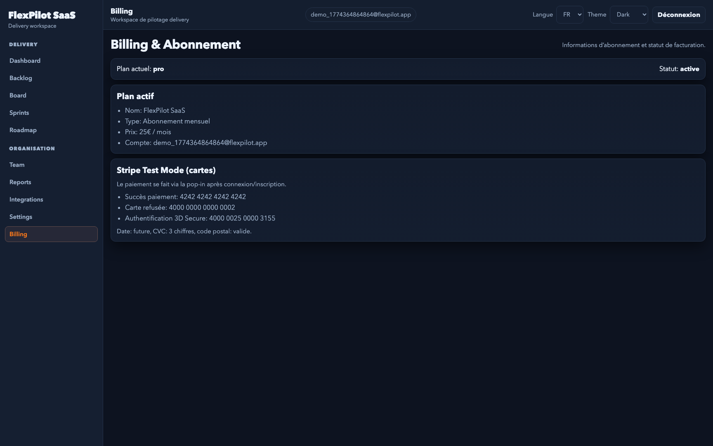
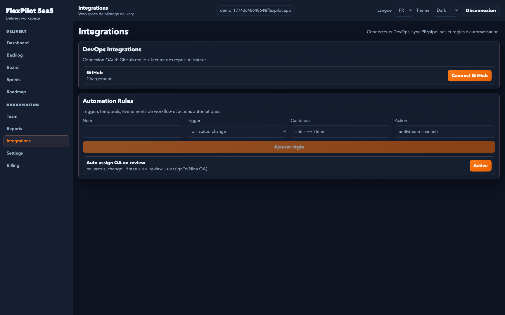

# Projet Final — FlexPilot SaaS

SaaS de pilotage delivery orienté exécution (Backlog, Board, Sprint, Roadmap, Reports, Team, Billing) construit avec une architecture **Feature Sliced Design**.

## Lien production

https://archi-front.web.app

## Screenshots Démo










## Stack et justifications

- **Vite + React + TypeScript strict**: setup rapide, DX excellente, pertinent pour un SaaS SPA.
- **Firebase (Auth + Firestore + Hosting)**: backend managé rapide pour auth, CRUD et publication.
- **Feature Sliced Design**: séparation claire du code (`app`, `pages`, `widgets`, `features`, `entities`, `shared`).
- **Zustand**: store global léger pour préférences utilisateur (persisté).
- **React Query**: data fetching/mutations backend + cache client robuste.
- **Zod + React Hook Form**: validation runtime API et formulaires typés.
- **Vitest + React Testing Library**: tests unitaires et composants.

## Arborescence FSD

```txt
src/
  app/                 # bootstrap application (providers, routing, styles globaux)
  pages/               # pages/vues (auth, dashboard, backlog, board, sprints, roadmap, team, reports, billing, settings)
  widgets/             # blocs UI composites (shell, overview, liste)
  features/            # actions métier (auth, CRUD work items/sprints, filtres, board actions, préférences, billing Stripe)
  entities/            # entités métier (work-item, sprint, user)
  shared/              # infra commune (firebase, helpers, store Zustand)
```

Chaque slice expose une API publique via `index.ts`.

## Fonctionnalités couvertes

- Authentification: inscription, connexion, déconnexion (Firebase Auth)
- Dashboard utilisateur: métriques work items + sprint actif
- CRUD complet sur `workItems` et `sprints` (Firestore)
- Interactions distantes: déplacement board, assignation sprint, favoris
- Filtres/recherche backlog (texte, type, statut, priorité, sprint, assignee)
- Paramètres complets (profil, affichage, notifications, delivery rules) via Zustand persist
- Thème orange + dark/light/system
- Billing Stripe via Payment Links (`/billing`)
- Pages principales: `/auth`, `/`, `/backlog`, `/board`, `/sprints`, `/sprints/:id`, `/roadmap`, `/team`, `/reports`, `/settings`, `/billing`

## Installation locale

1. Installer les dépendances

```bash
npm install
```

2. Configurer les variables d’environnement

```bash
cp .env.example .env
```

Puis compléter les valeurs Firebase dans `.env`.

Variables Stripe (facultatives mais nécessaires pour `/billing`):

- `VITE_STRIPE_PAYMENT_LINK_PRO`
- `VITE_STRIPE_PAYMENT_LINK_BUSINESS`
- `VITE_GITHUB_CLIENT_ID` (nécessaire pour la liaison GitHub OAuth)

3. Lancer en local

```bash
npm run dev
```

4. Lancer les tests

```bash
npm run test
```

## CI + Auto Deploy (GitHub Actions)

Le repo inclut maintenant 2 workflows:

- `.github/workflows/ci.yml`: lint + tests + build sur chaque `push` et `pull_request`
- `.github/workflows/deploy.yml`: auto-déploiement Firebase après succès de CI sur la branche `main`

### Secrets GitHub requis

Dans `GitHub > Settings > Secrets and variables > Actions`, créer ces secrets:

- `FIREBASE_SERVICE_ACCOUNT_ARCHI_FRONT` (JSON complet de la clé service account Firebase)
- `VITE_FIREBASE_API_KEY`
- `VITE_FIREBASE_AUTH_DOMAIN`
- `VITE_FIREBASE_PROJECT_ID`
- `VITE_FIREBASE_STORAGE_BUCKET`
- `VITE_FIREBASE_MESSAGING_SENDER_ID`
- `VITE_FIREBASE_APP_ID`
- `VITE_STRIPE_PUBLISHABLE_KEY`
- `VITE_STRIPE_API_BASE_URL` (valeur: `/api/stripe`)
- `VITE_GITHUB_CLIENT_ID`
- `STRIPE_SECRET_KEY`
- `STRIPE_PRICE_ID`
- `APP_BASE_URL` (valeur prod: `https://archi-front.web.app`)
- `GITHUB_CLIENT_SECRET`

### Générer la clé `FIREBASE_SERVICE_ACCOUNT_ARCHI_FRONT`

1. Ouvrir Firebase Console > `Project settings` > `Service accounts`
2. Cliquer `Generate new private key`
3. Copier le contenu JSON complet
4. Coller ce JSON brut dans le secret GitHub `FIREBASE_SERVICE_ACCOUNT_ARCHI_FRONT`

### Flux CI/CD

1. Push sur une branche: CI exécute `npm ci`, `npm run lint`, `npm run test -- --run`, `npm run build`
2. Merge/push sur `main`
3. Si CI est verte, le workflow `Deploy Firebase` publie automatiquement:
   - Hosting
   - Functions
   - Firestore rules
   - Firestore indexes

### Vérification rapide

- Onglet `Actions` sur GitHub: vérifier `CI` puis `Deploy Firebase` en vert
- URL prod: [https://archi-front.web.app](https://archi-front.web.app)

## Configuration Firebase

### 1) Créer le projet Firebase

- Créer un projet sur Firebase Console
- Activer **Authentication > Email/Password**
- Activer **Firestore Database**

### 2) Déployer les règles Firestore

```bash
firebase login
firebase use --add
firebase deploy --only firestore:rules
```

### 3) Déployer l’application (publication)

```bash
npm run build
firebase deploy --only hosting
```

Alternative via script:

```bash
npm run deploy:firebase
```

### 4) Configurer la liaison GitHub réelle

1. Créer une OAuth App sur GitHub (`Settings > Developer settings > OAuth Apps`)
2. Renseigner:

- Homepage URL: `https://archi-front.web.app`
- Authorization callback URL: `https://archi-front.web.app/integrations`

3. Configurer les variables:

- Frontend `.env`: `VITE_GITHUB_CLIENT_ID`
- Functions `functions/.env`: `GITHUB_CLIENT_ID`, `GITHUB_CLIENT_SECRET`

4. Déployer les functions:

```bash
firebase deploy --only functions
```

## Scripts

- `npm run dev`: démarrage local
- `npm run build`: build production
- `npm run preview`: preview build
- `npm run test`: exécution tests Vitest
- `npm run test:watch`: mode watch
- `npm run deploy:firebase`: build + déploiement Firebase
